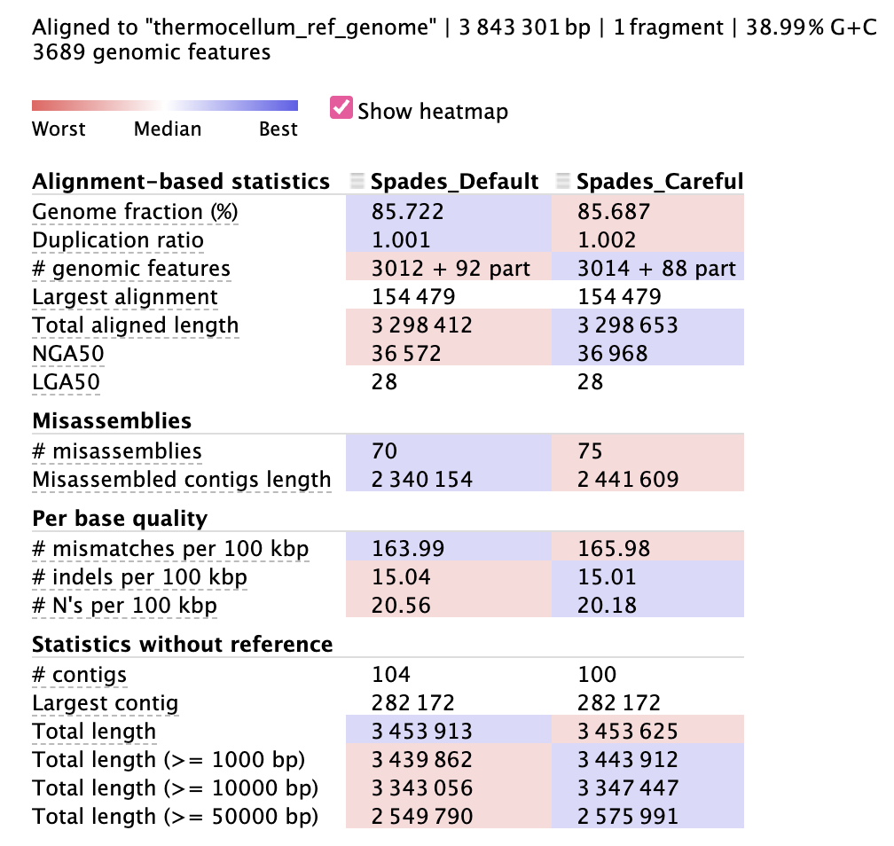
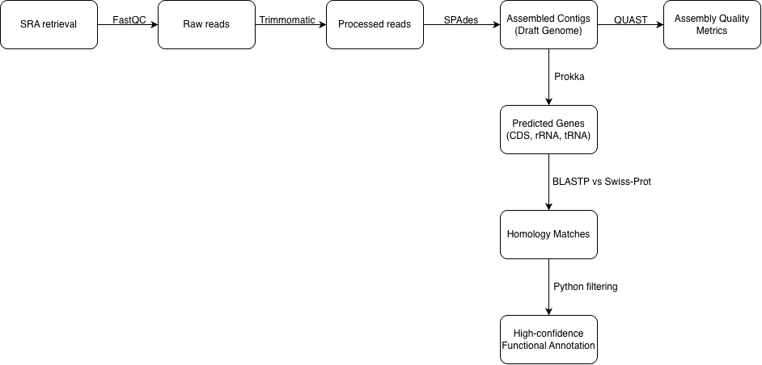

# Thermocellum Genome Assembly & Annotation
## Project Overview
This project demonstrates a complete workflow for **de novo genome assembly and annotation** of *Clostridium thermocellum* using publicly available sequencing data. 
The pipeline includes: 
1. SRA retrieval (SRR15202685)
2. Quality Control (FastQC)
3. Read Trimming (Trimmomatic)
4. De Novo Assembly (SPAdes)
5. Assembly Evaluation (QUAST)
6. Structural Annotation (Prokka)
7. Homology-Based Functional Annotation (BLASTP vs Swiss-Prot)
8. Functional Refinement

## Objective:
The objective of this project was to perform a complete de novo genome assembly and functional annotation of Clostridium thermocellum DSM1313 using short-read sequencing data.

## Key Findings:

- A 3.49 Mb draft genome was assembled across 286 contigs, consistent with expected genome size for C. thermocellum.
- Prokka identified:
   - 2,981 coding sequences (CDS)
   - 55 tRNAs
   - 4 rRNAs
   - 1 tmRNA
- 726 high-confidence matches (24.35%) in BLASTP against Swiss-Prot

## File Structure
```
thermo-genome-assembly-annotation/
├── data/
├── results/
│   ├── figures/
│   ├── docs/
├── scripts/
│   ├── 01-genome-assembly-pipeline.sh
│   ├── 02-gene-annotation
├── environment.yml
└── README.md
```

## Results 
**Assembly Statistics (Spades_Careful):**
<p align="center">
  
</p>  

- N50:  `40,549 bp`  
- Total assembly length: `3,300,239`  
- Genome fraction: `85.727%`  
- Misassemblies: `68`  

**Annotation (Prokka):**
- Predicted coding sequences (CDS): `2981`
- rRNAs and tRNAs detected: `4 rRNA, 55 tRNA`
- Functional annotations via SwissProt: `~24%`

**Top SwissProt Protein Hits**
| Accession | E-Value | % Identity | BitScore |
| :-------: | :------: | :-------: | :-------: |
| A3DIJ8 | 1.32E-58 | 94.737 | 179.0|
| A3DIK9 | 0.0 | 100 | 509.0 |
| A3DIL4 | 0.0 | 100 | 741.0 |
| Q9UYB2 | 3.13E-121 | 54.277 | 355.0 |
| P37351 | 3.25E-53 | 57.931 | 169.0 |

## Workflow
<p align="center">
  
</p>  

## Discussion
This project implemented an end-to-end de novo genome assembly and annotation pipeline for Clostridium thermocellum using short-read sequencing data. After quality control and trimming, SPAdes generated a draft genome assembly totaling 3.49 Mb across 286 contigs. QUAST analysis indicated high genome fraction relative to the reference, consistent with a draft-quality bacterial assembly. Fragmentation likely reflects short-read limitations in repetitive regions.

Prokka predicted 2,981 coding sequences along with tRNA and rRNA genes, aligning with expected bacterial genome architecture. Functional annotation using BLASTP against the curated Swiss-Prot database, followed by stringent filtering, identified 726 high-confidence protein matches (24.35% of CDS). This conservative annotation rate reflects the limited but high-confidence nature of Swiss-Prot and prioritizes reliability over coverage.

Overall, the workflow demonstrates a reproducible genome assembly and functional annotation strategy, producing a biologically consistent draft genome suitable for downstream comparative and metabolic analysis.
